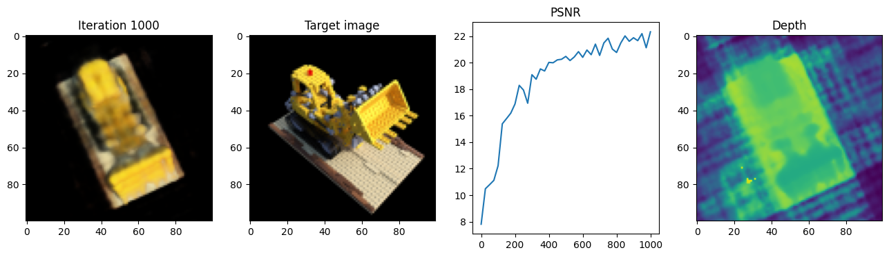
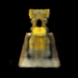

# Neural Radiance Fields (NERF) Network
## CS 4476 - Computer Vision (Project 06)

This project involves designing and training a Neural Radiance Field (NeRF) to render 3D scenes. NeRF encodes scene information using a Multilayer Perceptron (fully connected neural network), enabling realistic rendering from different viewpoints. ([Source](https://www.matthewtancik.com/nerf))

<em>Figure 1: Output after 1000 iterations</em>

> After 2000 iterations with 64 depth samples per ray. The training utilized GPU acceleration and processed camera parameters, images, and scene details to render 3D scenes.

  
   
  <em>Figure 2: Rendered Scene using NeRF</em>

  <em>Georgia Tech (Fall 2024)</em>

